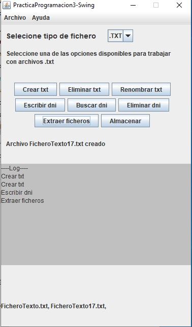

# filesPlay
-A compulsory activity from school

This activity was focused on learning some applied OOP using java.swing and java.awt,
plus playing around with java.io.Files.. to modify files, a litle bit of regex can be found too.

It is not a user friendly GUI because one condition was the use of reusable code, so the gui was designed
in a "switch bucle" way of thinking, like the activity written before.

This software was not designed to be trusted, errors may happen.

@Version: 1.0 (further updates not scheduled)
06/01/2020
